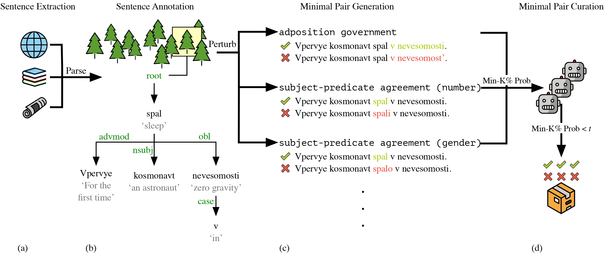

# RuBLiMP

**RuBLiMP**, or **Ru**ssian **B**enchmark of **Li**nguistic **M**inimal **P**airs, is the first diverse and large-scale benchmark of minimal pairs in Russian.

RuBLiMP includes **45k** minimal pairs of sentences that differ in grammaticality and isolate morphological, syntactic, or semantic phenomena. In contrast to existing benchmarks of linguistic minimal pairs, RuBLiMP is created by applying linguistic perturbations to automatically annotated sentences from open text corpora and decontaminating test data, making the minimal pairs more diverse and natural.

The datasets are published in the [HuggingFace datasets library](https://huggingface.co/datasets/RussianNLP/rublimp) and are available in [this repository](./datasets).

## :fire: Updates
**`01.10.2024`**: :busts_in_silhouette: [Human annotation guidelines](/human_annotation_guidelines/) are released \
**`20.09.2024`**: :tada: RuBLiMP accepted to [EMNLP 2024 Main Track](https://2024.emnlp.org/program/accepted_main_conference/)! \
**`09.07.2024`**: :space_invader: The datasets and the code for data generation and model evaluation are released on [GitHub](https://github.com/RussianNLP/RuBLiMP/tree/main) and [HuggingFace](https://huggingface.co/datasets/RussianNLP/rublimp) \
**`01.07.2024`**: :closed_book: **RuBLiMP: Russian Benchmark of Linguistic Minimal Pairs** paper is available on [arXiv](https://arxiv.org/abs/2406.19232)


## Table of Contents
- [Dataset Creation](#robot-dataset-creation)
- [Phenomena](#books-phenomena)
- [Setup and Usage](#zap-setup-and-usage)
    - [Data](#data)
    - [Minimal Pair Generation](#minimal-pair-generation)
    - [Scoring with Min-K](#scoring-with-min-k)
- [Cite Us](#link-cite-us)
- [License](#license)

## :robot: Dataset Creation



Example: *Vpervye kosmonavt spal v nevesomosti* "For the first time an astronaut slept in zero gravity".

The RuBLiMP's creation approach comprises four stages:

- **(a)** Extract sentences from publicly available corpora of Wikipedia texts, news articles, and books.
- **(b)** Annotate each extracted sentence in the Universal Dependencies scheme with a multidomain morphosyntactic parser for Russian.
- **(c)** Search the dependency trees for specific lexical units and linguistic structures and apply expert-written perturbation rules to create a pool of minimal pairs for a target paradigm.
- **(d)** Compute [Min-K\% Prob](https://swj0419.github.io/detect-pretrain.github.io/) for each grammatical sentence in the pool using a set of LMs. Select *t* (the threshold for the maximum Min-K\% Prob value), which allows to find an intersection of 1k minimal pairs between the LMs. The minimal pairs in the intersection contain grammatical sentences that are not detected as the LMs' pretraining examples.


## :books: Phenomena

:pushpin: See full documentation for the phenomena [here](./src/phenomena/).

### Morphology

<details>
    <summary><b>Word Formation</b></summary>

- **Addition of Extra Morphemes: Uninterpretable Suffix Combinations** (`add_new_suffix`) \
     Adding a new suffix to the noun or adjective to create a non-existing word

- **Addition of Extra Morphemes: Verb Prefixes** (`add_verb_prefix`) \
    Adding a prefix to a verb to create a violation of prefix stacking rules.

- **Morpheme Permutation: Verb Prefixes** (`change_verb_prefixes_order`) \
    Changing the order of the verb's prefixes to create a violation of prefix stacking rules.

</details>

<details>
    <summary><b>Word Inflection</b></summary>

- **Replacement of Inflectional Affixes: Noun Declensions (Simple)** (`change_declension_ending`) \
    Changing the inflectional suffixes of a noun to the suffixes of another declension

- **Replacement of Inflectional Affixes: Declensions of Nouns With Agreeing Dependents** (`change_declension_ending_has_dep`) \
    Changing the inflectional suffixes of a noun to the suffixes of another declension in the presence of an agreeing noun modifier

- **Inflectional Affixes: Verbal Conjugation Swap** (`change_verb_conjugation`) \
    Replacing the verb’s inflection with inflection of the opposite conjugation


</details>


### Syntax 
<details>
    <summary><b>Government</b></summary>

- **Prepositional Government** (`adp_government_case`) \
    Changing the case of a noun, governed by a preposition

- **Verbal Government: Direct Object** (`verb_acc_object`) \
    Changing the case of a direct verb object

- **Verbal Government: Genitive Object** (`verb_gen_object`) \
    Changing the case of an indirect verb object in Genitive case

- **Verbal Government: Object in Instrumental Case** (`verb_ins_object`) \
    Changing the case of an indirect verb object in Instrumental case

- **Verbal Government: Nominalizations** (`nominalization_cas`) \
    Changing the case of a dependent of a nominalization 

</details>


<details>
    <summary><b>Subject-Predicate Agreement</b></summary>

- **Subject-Predicate Agreement (Number)** (`noun_subj_predicate_agreement_number`) \
    Changing the number of the predicate to be distinct from its subject's (or, sometimes, changing number of the subject to be distinct from its predicate's) 

- **Genitive Subject-Predicate Agreement (Number)** (`genitive_subj_predicate_agreement_number`) \
    Changing the number of the predicate to plural, when subject is genitive and the agreement must be the default singular neuter

- **Clausal Subject-Predicate Agreement (Number)** (`clause_subj_predicate_agreement_number`) \
    Changing the number of the predicate to plural, when subject is a clause and the agreement must be the default singular neuter 

- **Subject-Predicate Agreement in Presence of an Attractor (Number)** (`subj_predicate_agreement_number_attractor`) \
    Changing the number of the verb to that, which is different from the subject, but the same as subject's dependent, or the attractor   

- **Subject-Predicate Agreement (Gender)** (`noun_subj_predicate_agreement_gender`) \
    Changing the gender of the predicate to be distinct from its subject's (or, sometimes, changing number of the subject to be distinct from its predicate's) 

- **Genitive Subject-Predicate Agreement (Gender)** (`genitive_subj_predicate_agreement_gender`)
    Changing the gender of the predicate to feminine or masculine, when subject is genitive and the agreement must be the default singular neuter

- **Clausal Subject-Predicate Agreement (Gender)** (`clause_subj_predicate_agreement_gender`) \
    Changing the gender of the predicate to feminine or masculine, when subject is a clause and the agreement must be the default singular neuter

- **Subject-Predicate Agreement in Presence of an Attractor (Gender)** (`subj_predicate_agreement_gender_attractor`) \
    Changing the gender of the verb to that, which is different from the subject, but the same as subject's dependent, or the attractor

- **Subject-Predicate Agreement (Person)** (`noun_subj_predicate_agreement_person`) \
    Changing the person of the predicate to be distinct from its subject's

- **Genitive Subject-Predicate Agreement (Person)** (`genitive_subj_predicate_agreement_person`) \ 
    Changing the person of the predicate to first or second person, when subject is genitive and the agreement must be the default third person singular

- **Clausal Subject-Predicate Agreement (Person)** (`clause_subj_predicate_agreement_person`) \ 
    Changing the person of the predicate to first or second person, when subject is a clause and the agreement must be the default third person singular
 
</details>


<details>
    <summary><b>Anaphor Agreement</b></summary>

- **Anaphor Agreement (Number)** (`anaphor_agreement_number`) \
    Changing the number of the relative pronoun or of its head noun 

- **Anaphor Agreement (Gender)** (`anaphor_agreement_gender`) \
    Changing the gender of the relative pronoun     

</details>

<details>
    <summary><b>Noun Phrase Agreement</b></summary>

- **Noun Phrase Agreement (Number)** (`np_agreement_number`) \
    Changing the number of an agreeing adjective 

- **Noun Phrase Agreement (Gender)** (`np_agreement_gender`) \
    Changing the gender of an agreeing adjective

- **Noun Phrase Agreement (Case)** (`np_agreement_case`) \
    Changing the case of an agreeing adjective 

</details>

<details>
    <summary><b>Floating Quantifier Agreement</b></summary>

- **Floating Quantifier Agreement (Number)** (`floating_quantifier_agreement_number`) \
    Changing the number of the quantifier or of the controller

- **Floating Quantifier Agreement (Gender)** (`floating_quantifier_agreement_gender`) \
    Changing the gender of the quantifier or of the controller

- **Floating Quantifier Agreement (Case)** (`floating_quantifier_agreement_case`) \
    Changing the case of the quantifier or of the controller

</details>


<details>
    <summary><b>Reflexives</b></summary>

- **External Possessor** (`external_possessor`) \
    Change a noun phrase or a pronoun to a reflexive pronoun sebya ‘self’ in a *u*-phrase inside the existential *be*-possessive construction.

</details>

<details>
    <summary><b>Negation</b></summary>

- **Negative Concord** (`negative_concord`) \
    Shifting the negative particle *ne* from a negated verb to another word in the sentence to violate negative concord rules.

- **Replacement of a Negative Pronoun with an Indefinite One** (`negative_pronoun_to_indefinite`) \
    Replacing an negative pronoun in the construction without a negated verb to an indefinite pronoun

- **Replacement of an Indefinite Pronoun with a Negative One** (`indefinite_pronoun_to_negative`) \
    Replacing an indefinite pronoun in the construction with a negated verb to a negative pronoun

</details>


### Semantics

<details>
    <summary><b>Argument Structure</b></summary>

- **Transitivity** (`transitive_verb`) \
    Replacing a transitive verb with an intransitive one

- **Animate Subject of a Transitive Verb** (`transitive_verb_subject`) \
    Swapping the subject and the direct object of a transitive verb or replacing the subject with a random inanimate word

- **Animate Subject of a Passive Verb** (`transitive_verb_passive`) \
    Swapping the subject and the direct object of a transitive verb in a passive construction or replacing the subject with a random inanimate word

- **Animate Direct Object of a Transitive Verb** (`transitive_verb_object`) \
    Replacing the direct object with a random inanimate word

- **Animate Indirect Object of a Transitive Verb** (`transitive_verb_iobject`) \
    Swapping the subject and the indirect object of a transitive verb or replacing the indirect subject of a transitive verb with a random inanimate word


</details>


<details>
    <summary><b>Aspect</b></summary>

- **Incompatibility of the Perfective with the Semantics of Duration** (`change_duration_aspect`) \
Replacing an imperfective verb with a perfective one in contexts with semantics of duration

- **Impossibility of the Perfective in Repetitive Situations** (`change_repetition_aspect`) \
Replacing an imperfective verb with a perfective one in contexts with semantics of repetition

- **Impossibility of the Perfective Under Negated Strong Deontic Verbs** (`deontic_imperative_aspect`) \
Replacing an imperfective verb with a perfective one in contexts with a negated deontic verb

</details>

<details>
    <summary><b>Tense</b></summary>

- **Tense** (`single_verb_tense`) \
    Changing verb tense in the presence of a temporal adverbial

- **Tense (coordination)** (`conj_verb_tense`) \
    Changing the tense of a conjoined verb in the presence of a temporal adverbial

- **Tense Markers** (`tense_marker`) \
    Changing a temporal adverbial in a sentence with a tense-marked verb

</details>


## :zap: Setup and Usage

```bash
git clone https://github.com/RussianNLP/RuBLiMP.git
cd RuBLiMP/
```

### Data

:pushpin: A description of all of the additional resources used for generation is provided [here](./src/data).

**NB:** Certain phenomena in RuBLiMP utilize additional annotations provided by the [Russian National Corpus](https://ruscorpora.ru/en/). We are unable to distribute these annotations; however, we include a small sample of the data for demonstration purposes.

:mailbox_closed: For access to the complete annotated data, please contact [np-rnc\@yandex.ru](mailto:np-rnc\@yandex.ru).


### Minimal Pair Generation
:pencil: An example for generating minimal pairs using a Universal Dependency Treebank can be found [here](./examples/generation_example.ipynb).

**Quick start:**

1. Install the required modules

    ```bash
    pip install --quiet pymorphy2 conllu razdel sentence-transformers
    ```

2. Generate minimal pairs

    ```bash
    cd src/
    python generator.py \
        --phenomenon {phenomenon_name} \
        --data_fname {conllu_fname} \
        --output_fdir_name generated_data \
        --sample True
    ```

### Scoring with Min-K
:pencil: An example for scoring an external encoder and decoder LM on RuBLiMP and calculating Min-K scores can be found [here](./examples/scoring_example.ipynb).

**Quick start:**

1. Install the required modules

    ```bash
    pip install -U transformers datasets
    ```

2. Load the data

    ```python
    from datasets import load_dataset


    add_new_suffix = load_dataset("RussianNLP/rublimp", "add_new_suffix")
    add_new_suffix = add_new_suffix["train"].to_pandas()
    ```

3. Load the scorer model

    ```python
    from src.scorer import Scorer


    model_name = "DeepPavlov/rubert-base-cased"
    scorer = Scorer(model_name=model_name)
    ```

4. Evaluate model

    ```python
    # calculate perplexity scores or pseudo-perplexity scores
    sample = scorer.run(pool=add_new_suffix)

    # calculate accuracy
    # note, that due to the way PPL and PPPL are calculated
    # you should use the < sign to calculate decoder model scores
    # and > when working with an encoder, as showwn below
    (
        sample["DeepPavlov-rubert-base-cased-ppl-s"]
        > sample["DeepPavlov-rubert-base-cased-ppl-t"]
    ).mean()
    ``` 

## :link: Cite us
```
@misc{taktasheva2024rublimprussianbenchmarklinguistic,
      title={RuBLiMP: Russian Benchmark of Linguistic Minimal Pairs}, 
      author={Ekaterina Taktasheva and Maxim Bazhukov and Kirill Koncha and Alena Fenogenova and Ekaterina Artemova and Vladislav Mikhailov},
      year={2024},
      eprint={2406.19232},
      archivePrefix={arXiv},
      primaryClass={cs.CL},
      url={https://arxiv.org/abs/2406.19232}, 
}
```


## License

Our datasets and evaluation code are available under the Apache 2.0 license. The copyright (where applicable) of sentences from the publicly availalbe corpora remains with the original authors or publishers.
